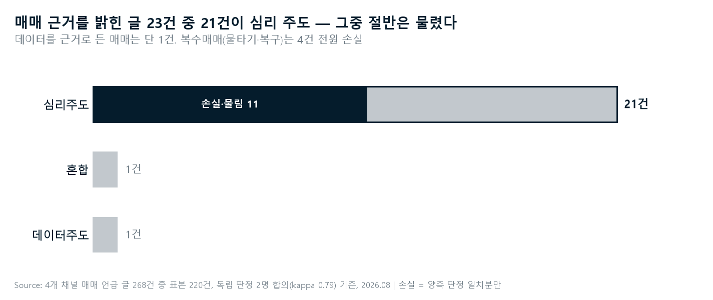

# 한 번 더 (Decision Mirror)

> **사기 전에, 근거 한 번 더.**
>
> 증권앱을 여는 순간 한 가지를 묻는다 — *"지금 이 매매의 이유는 무엇인가요?"*
> 그 탭 하나가 **마찰**이자, **기록**이자, 나중의 **거울**이 된다.

투자 추천기가 아니다. 심리 진단기도 아니다. 매매 직전에 "왜"를 묻고 기록하는 도구다.

🔗 **프로토타입 (라이브)**: https://dariajkim-star.github.io/decision-mirror/

---

## 1. 문제 — 사람들은 데이터가 아니라 심리로 매매하고, 물린다

개인투자자의 매수·매도는 실적·밸류에이션이 아니라 **급등하는 분위기, 남들이 번다는 소식, 복구하고 싶은 조바심**으로 결정되는 경우가 많다. 그리고 그 매매는 물림으로 끝난다.

이것이 실제 시장에 존재하는 pain point인지 **확인하는 것**에서 이 프로젝트는 시작됐다.

## 2. 시장 검증 — 크롤링은 이 질문에 답하기 위해 수행됐다

4개 채널(네이버 종목토론방·디시인사이드 주식갤·유튜브 삼프로TV/슈카월드)에서 **5,022건**을 수집하고, 매매를 언급한 글 **268건 전수**를 **독립 판정자 2명**이 원문만 보고 분류했다 (일치율 89.6%, Cohen's kappa 0.73).



| # | 발견 | 수치 (합의 기준, Wilson 95% CI) |
|---|---|---|
| 1 | 매매 근거를 밝힌 글 중 **심리 주도** | **24/26건 — 92% [76–98%]** (데이터 주도는 1건) |
| 2 | 심리 주도 매매 중 **손실·물림·후회 동반** | **46% [28–65%]** (수익 언급 3건) |
| 3 | **복수매매(물타기·복구) 손실률** | **4/4건 — 100%** (두 판정자 독립 동일 결론) |

> *"이재명 최태원 말듣고 샀다가 인버스로 80% 복구중"* — 군집
> *"고점에 물려 2달동안 고문받고있다..물타고 물타도 손실만 더 키웠는데"* — 복수매매
> *"본전만 올라오면 국장 정리하고 미장으로 몰빵간다"* — 다음 심리 매매의 예약

**보조 발견**: 감정 분석(층화 추정, kappa 0.816) 결과 커뮤니티의 지배 감정은 분노·외부귀인(85.7%)이고 FOMO 언어화는 0.8%에 불과하다. 빈도 상위 키워드는 '실적·투자·반도체' — **심리는 분노와 합리화의 언어 뒤에 숨는다. 텍스트만으로는 실시간 포착이 불가능하다.**

*한계 명시: 근거가 드러난 매매는 26건으로 CI가 넓다. outcome은 자기보고라 생존 편향 가능. "데이터 주도 1건"은 커뮤니티 글쓰기 관행의 반영일 수 있다.*

## 3. 공백 — 매수 직전에 "근거"를 묻는 도구는 없다

```
                 사후 회고               매매 직전
결과 기록        트레이딩 저널 전부         —
근거 기록        Edgewonk Tiltmeter        ★ 한 번 더
                 (감정 태그, 수기·사후)      (그 순간, 탭 하나)
```

- 트레이딩 저널(Tradervue·TraderSync·Edgewonk·TradeZella)은 전부 **사후 + 자기보고**
- 증권앱·커뮤니티는 급등 알림·수익 인증으로 **가속 장치만** 제공
- 반복해도 학습이 없다 — 결과(수익률)는 기록되지만 **그때 이유가 뭐였는지**는 기록되지 않는다

> 기존 저널은 **무엇을 샀는지** 기록하고, 한 번 더는 **왜 샀는지**를 — 사기 전에 — 기록한다.

## 4. 제품 — 근거 질문 인터셉트

```
[증권앱 아이콘 터치]
      ↓ iOS 단축어 자동화 (one sec과 동일한 실증 경로 — PNAS 2020, 앱 열기 36% 중단)
[한 번 더]가 먼저 열린다

      지금 이 매매의 이유는 무엇인가요?
      [ 📊 분석/전략 ]  [ ❤️ 감정/기분 ]  [ 🌱 습관/반복 ]
      시세만 볼게요 ›
      [ 오늘은 그만 ]  [ 계속하기 ]
      🔒 기록은 이 기기에만 저장돼요 · 심박 평소보다 +14 · 어젯밤 수면 6h 20m

[계속하기] → 증권앱      [오늘은 그만] → 홈
```

**탭 하나가 세 가지 일을 한다:**

1. **마찰** — 답을 고르는 3초가 자동반응을 의식적 결정으로 바꾼다. 실증 연구에서 유효한 개입은 마찰과 명시적 이탈 경로뿐, 설교는 효과가 없었다
2. **라벨** — 매매 **직전**, 합리화가 완성되기 전의 자기 판단이 기록된다. 사전 등록(채택률 낮음)도 사후 회고(오염됨)도 아닌 제3의 라벨 수집 경로
3. **거울** — 쌓인 라벨이 자기 이력이 되어 돌아온다. 자기가 누른 버튼이므로 반박이 불가능하다.

**거울은 두 층이다 — 그리고 v1은 1층만 짓는다:**

| 층 | 내용 | 예시 | 시점 |
|---|---|---|---|
| **1층 행동 사실** | 라벨 비율 · 평균 보유기간 · 손실 중 재진입(물타기) 횟수 | *"'감정/기분' 매매의 평균 보유기간은 4일, '분석/전략'은 21일이에요"* | **v1 — 라벨만으로 성립** |
| 2층 수익률 | 근거별 손익 | *"'감정/기분' 5건 평균 −12%"* | 체결 이력 연결 후, 별도 결정 |

이 순서는 기술 제약이 아니라 **정체성 결정**이다. 이 제품은 **성찰 도구이지, 손실을 들이밀어 행동을 교정하는 도구가 아니다.** 수익률은 아무리 중립적으로 그려도 사용자의 심장에는 평가로 도착할 수 있다 — 그래서 거울의 역할(자기 패턴의 인식)이 행동 사실만으로 성립하는지를 먼저 검증하고, 수익률 층은 그 검증 뒤에 별도로 판단한다.

**거울의 규율 (층과 무관하게):**
- **거울은 찾아오지 않는다.** 푸시·알림으로 거울을 들이밀지 않는다. 사용자가 스스로 탭을 열어 들어온 순간에만 존재한다. 매수 직전 인터셉트에는 거울 요소를 두지 않는다 — 그 순간의 이력 제시는 회고가 아니라 "사지 마"라는 판정이 되기 때문이다
- **손익의 두 용법을 섞지 않는다.** 손익으로 *개입*을 판정하는 것(❌ §5에서 금지 — "질문 받고 샀는데 올랐으니 개입 실패" 같은 채점)과, 사용자의 *과거*를 사실로 보여주는 것(2층, 유예됨)은 다른 행위다. 전자는 영구 금지, 후자는 유예된 선택이다

**심리매매 지수** — VIX가 시장의 공포를 재듯, 축적된 라벨로 **내 매매에서 심리가 차지하는 비율**을 잰다. 월 단위, 산식 고정·공개, 평가어 없이.

**복수매매 쐐기** — 가장 파괴적인 패턴(4/4 손실)이 가장 감지하기 쉽다. 손실 중 종목 재진입은 체결 이력만으로 식별되며, 이때 인터셉트에 사실 두 줄이 붙는다: *"이 종목은 현재 −18% 보유 중이에요. 직전 매수는 7월 22일이었어요."* — 명명도 판정도 없이. (체결 이력 연결이 선결 조건 — 거울 2층과 같은 게이트 뒤에 있다. 단, v1에서도 **동일 종목 반복 라벨**만으로 재진입 *횟수*는 셀 수 있다)

### 말할 수 있는 것과 없는 것

| 레벨 | 예시 | |
|---|---|---|
| L1 사실 | "심박이 평소보다 14 높아요" | ✅ 보조 |
| **L2a 자기 이력 — 행동** | "'감정/기분' 매매의 평균 보유기간은 4일이에요" | ✅ **핵심 (v1)** |
| L2b 자기 이력 — 손익 | "'감정/기분' 5건 평균 −12%" | ⏸ 유예 (거울 2층) |
| L3 판정 | "심리 매매입니다" / "사지 마세요" | ❌ 금지 |

L3 금지의 3중 근거 — **법**("지금 위험하다"는 시기 판단 = 투자자문업 해석 리스크), **과학**(내적 상태는 관측 불가·반증 불가), **행동과학**(판정은 방어를 유발하고, 커뮤니티 지배 감정인 분노·외부귀인이 앱으로 향한다). **질문은 판정이 아니다** — 이 제품의 철학과 규제 안전지대가 정확히 겹치는 지점이다.

### 생체 신호의 위치

심박·수면(Polar H10 + HealthKit)은 문제의 전부가 아니라 **심리 매매의 조기 신호 후보**다. "감정/기분" 라벨 매매 때 실제로 각성이 동반되는지가 검증 대상(H3)이며, 동반된다면 라벨이 쌓인 뒤 질문이 뜨기 전에 위험 구간을 예측할 수 있다. owner 1년 베이스라인 확보: 안정시 심박 46.8bpm, 수면 6.8h(변동 4.0~10.7h), 야간 HRV 54ms.

## 5. 검증 — n=1, 내 계좌와 내 몸으로 먼저

| # | 가설 | 위상 | 기각 조건 |
|---|---|---|---|
| **H4** | 사용에 따라 **심리매매 지수가 감소**하고 자가예측 정확도(Brier)가 개선된다 | **주가설 — v1은 이것만으로 선다** | 둘 다 미개선 |
| H1 | "감정/기분" 매매는 "분석/전략" 매매보다 성과가 나쁘다 (시장 검증의 본인 계좌 재현) | 주가설 · **공식 연기** — 체결 이력 연결 후 검증 (해결이 아니라 측정 시점의 이동임을 명시) | 차이 없음 → 제품 전제 약화 |
| H3 | "감정/기분" 매매 시 생체 각성이 동반되며 예측에 추가 가치를 준다 | 주가설 | 없음 → **웨어러블 제거** (제품은 생존) |
| H2 | 질문 표시 세션이 통과 세션보다 매수 전환율·규모를 낮춘다 (무작위 배정) | 보조 | 차이 없음 |

- **독립 ground truth**: 증권사 거래내역(체결시각·가격·수량). 자가보고는 정답지가 아니라 예측 대상
- **판정 원칙**: 질문에 답하고 계속 매수해도 **성공**이다 — 안 사게 하는 게 아니라 **알고 사게** 한다. 손익은 판정 근거가 아니다
- '상태 맹시'류의 전제는 두지 않는다 — 모든 주장은 위 가설로 반증 가능해야 한다

## 6. 설계 원칙

- **게이미피케이션 전면 금지** — 스트릭·배지·랭킹·달성률·평가어·재진입 유도 푸시. *금융앱 확인 강박을 '한 번 더' 확인 강박으로 바꾸면 자책골이다*
- **온디바이스** — 기록은 사용자 기기에만. 서버 전송 없음 (규제 방어이자 신뢰 자산)
- **다크패턴 금지** — [오늘은 그만]을 숨기거나 회색 처리해 진행을 유도하지 않는다
- **거울은 찾아오지 않는다** — 회고 화면으로의 유도 푸시·알림 금지. 성찰은 초대할 수 없고 방문받을 수만 있다
- 소표본 방어 — 라벨군 3건 미만이면 수치 대신 "기록이 더 쌓이면 보여드릴게요"

## 7. 현재 상태

| 단계 | 상태 |
|---|---|
| P0 시장 검증 | ✅ 268건 전수, 이중 판정, CI 병기 |
| PRD v3 · 화면 스펙 v2.1 | ✅ [prd.md](_bmad-output/planning-artifacts/prds/prd-decision-mirror-2026-08-04/prd.md) · [SCREEN-SPEC.md](design/SCREEN-SPEC.md) |
| 디자인 시안 | ✅ 4화면 (인터셉트·복수매매 변형·거울·지수) |
| **프로토타입 v0.1** | ✅ **라이브** — 웹앱 + iOS 단축어 자동화로 실제 인터셉트 동작. [설치 가이드](docs/SETUP.md) |
| owner 생체 베이스라인 | ✅ 가민 1년치 ([ingest/](ingest/)) |
| 거래내역 연동 | ⏸ **의도적 보류** — 거울 2층(수익률)·①b·H1의 선결 조건. 거울 v1(행동 사실)의 역할 검증이 먼저라는 정체성 결정에 따름 |
| 네이티브 (H10 BLE·HealthKit) | ⏳ Mac 확보 후 |

## 8. 리서치 재현·데이터 무결성

| 파일 | 역할 |
|---|---|
| [research/crawler*.py](research/) | 4채널 수집 (네이버 토론방 본문·댓글 API 리버싱 포함) |
| [extract_trade_posts.py](research/extract_trade_posts.py) → [score_trade_basis.py](research/score_trade_basis.py) | **매매 근거 분류** — 핵심 검증 |
| [lexicon.py](research/lexicon.py) → [score_lexicon.py](research/score_lexicon.py) | 감정 렉시콘 v2 + 독립 채점 — **v1은 정밀도 31.5%로 폐기하고 그 과정을 공개** |
| [verify_quotes.py](research/verify_quotes.py) | 인용문 존재+주장(claim) 검증 — 맥락 오독 1건 적발·철회 이력 포함 |
| [ingest/](ingest/) | 가민 실데이터 파서 + 베이스라인 리포트 |

- 수집 전 행에 고유 ID(`DM-000001`)·원본 파일/행번호·본문 해시 — 모든 인용이 원문으로 역추적된다
- 모든 사람 판정은 독립 2명 + Cohen's kappa 보고: [trade_basis_report.md](research/output/trade_basis_report.md) · [lexicon_scorecard.md](research/output/lexicon_scorecard.md)
- 페르소나는 창작하지 않았다 — [데이터에서 채굴](_bmad-output/planning-artifacts/prds/prd-decision-mirror-2026-08-04/persona-archetypes.md)
- 규제 분석(자본시장법·의료기기·개인정보): [research-landscape.md](_bmad-output/planning-artifacts/prds/prd-decision-mirror-2026-08-04/research-landscape.md)

---

*구 프로젝트명: No_FOMO → Decision Mirror. 초기 기획(P0)은 [PROPOSAL.md](PROPOSAL.md)로 보존. 의사결정 전 과정은 git 이력과 `.memlog.md`에 남아 있다 — 방향 전환 3회(가민 워치 → iOS 인터셉트 → 근거 질문)와 그 이유를 포함해서.*
